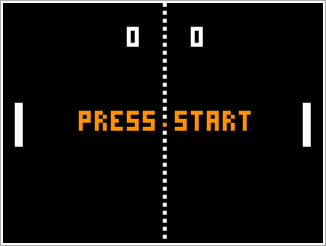
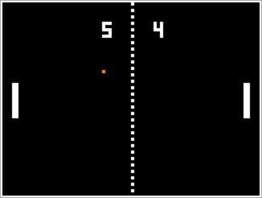
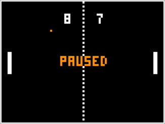
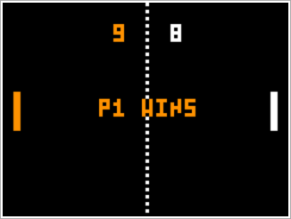

# Nios II VGA Out
Various VGA video output projects on the NIOS II processor, written in assembly.

The programs are designed to be compatible with Altera DE0, DE1-SoC, DE2 / DE2-115, and DE10-Lite FPGA boards.  
So far, the code has only been tested on the DE1-SoC board and is confirmed to be working.

## [Simulator website](https://cpulator.01xz.net/?sys=nios-de0)

## Projects so far:                                         
* **Pong**  
	- Basic two player implementation
	- Switches 9/8 control left paddle and 1/0 control right paddle
	- Switch 3 is used to pause the game
	- Button 0 is used to restart the game
	- With SNES controller support, Up/Down control left paddle, X/B control right paddle, and Start / Select start, pause, and restart the game
	- With two SNES controllers, Up/Down on a controller controls that player's paddle, and both players must press Start / Select to start the game
	- First player to reach a score of 9 wins
	
	 
	
	
	
	
	
	                     
* **Game of Life**  
	- Minimal proof of concept implementation for now
	- Preset glider pattern for testing
	
	
## Todo:
1. [x] Figure out double buffering (done on 2018-03-09)
1. [ ] Implement some form of randomness (starting ball directions, etc...)
	- In progress (PRNG implemented but not yet used)
1. [ ] Make the score numbers the same size on different display sizes
1. [ ] Make the ball speed constant on all display sizes
	- In progress
1. [x] Interface with one SNES controller (done on 2018-03-11)
1. [x] Interface with two SNES controllers (done on 2018-03-19)
1. [ ] Add Pong AI
1. [ ] Optimize GOL (tune memory access to increase speed)
1. [ ] Add random fill to init. GOL playfield
1. [ ] Add other rulesets to GOL (in a general way)
1. [ ] Add colouring of cells to GOL 
